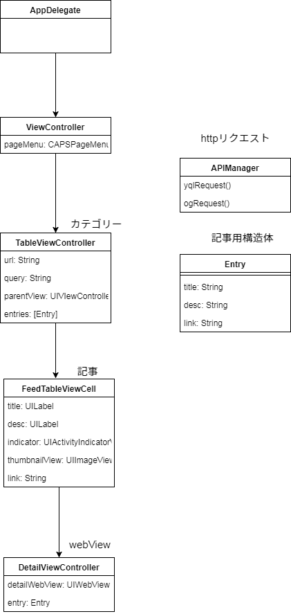

### [SwiftによるシンプルなRSSリーダーの作り方](http://webfood.info/swift-rss-reader/) 勉強用リポジトリ

## 手順

- 1 git clone https://github.com/tikyuu/RssReader-Swift.git
- 2 ターミナルでPodfileのある場所まで移動
- 3 pod install
- 4 生成されたRssReaderApp.xcworkspaceをダブルクリック
- 5 ビルド → 実行

## Architecture

